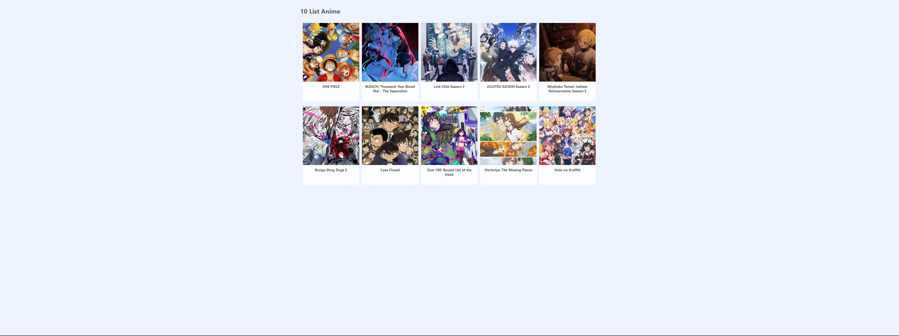
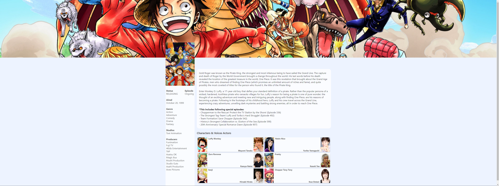

## Getting Started

First, run the development server, install yarn same version and next version that suit with this project:

```bash
yarn install
# and then
yarn start
```

This is the homepage 10 anime of the feature that been ask:


This is the anime detail of the feature that been ask:


Open [http://localhost:3000](http://localhost:3000) with your browser to see the result.

You can start editing the page by modifying `pages/index.tsx`. The page auto-updates as you edit the file.

[API routes](https://nextjs.org/docs/api-routes/introduction) can be accessed on [http://localhost:3000/api/hello](http://localhost:3000/api/hello). This endpoint can be edited in `pages/api/hello.ts`.

## Deploy on Vercel
