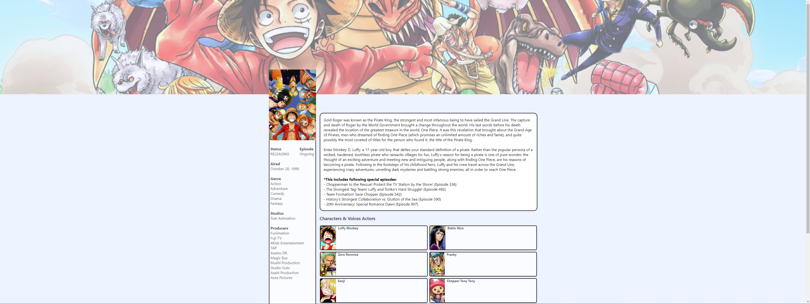

## Getting Started

First, run the development server, install yarn same version and next version that suit with this project:

```bash
yarn install
# and then
yarn start
```

This is the homepage 10 anime of the feature that been ask:


This is the anime detail of the feature that been ask:


Open [http://localhost:3000](http://localhost:3000) with your browser to see the result.

## Deploy on Vercel
